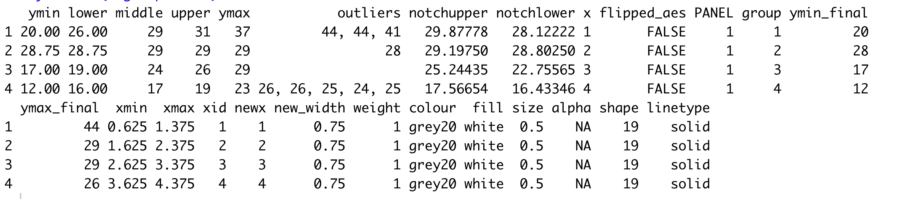
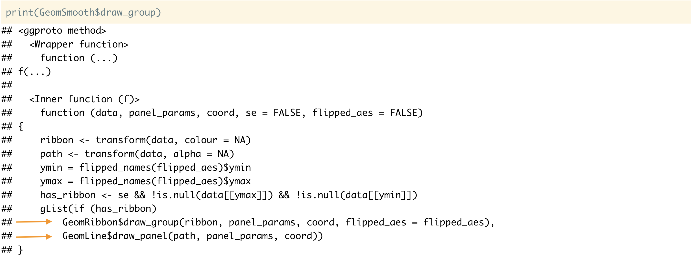
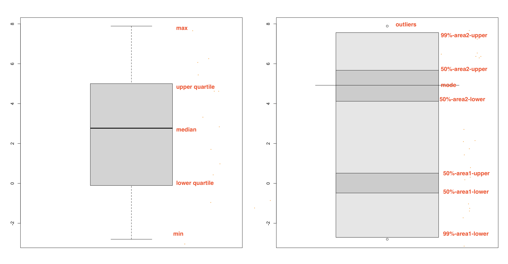

```{r setup, include=FALSE}
library(knitr)
opts_chunk$set(echo = FALSE, message=FALSE, warning=FALSE, cache=TRUE,
  dev.args=list(bg=grey(0.9), pointsize=11))
knitr::read_chunk('R/main.R') 
knitr::read_chunk('R/theme.R')
```


```{r load}
```

class: top left

# About me

.pull-left[
.smaller[
- Recently graduated from Monash University
- Ph.D. on visualization and analysis of probability distribution of large temporal data
- Like coding, data visualization, data analysis, time series analysis and forecasting, statistical modeling
- Part of [NUMBAT](https://numbat.space/) group
- Thanks R-Ladies Melbourne
]
]

.pull-right[

```{r, out.width="90%"}
include_graphics("images/avatar.jpg")
```

]

---

# Decomposing (Extension points) a ggplot into its consituents


.checked[ggplot2 creates graphics based on The Grammar of Graphics]

.checked[graphics built step by step by adding new elements that allows for extensive flexibility and customization of plots]

- Theme
- scales
- positions
- statistics
- geometries
- coordinates
- facets

<!-- - mapping  -->
<!-- - data -->
---

background-image: url("images/why-spec-image.png")

background-position: center
background-size: contain

---
background-image: url("images/print-spec-image.png")

background-position: center
background-size: contain

???

- We know geom_* can be used to specify a plot, but don't know how ggplot2 translates this plot specification into an image.

- Need to have some understanding to design extensions.

---

# ggplot2 Extensions

 - Extensions for all components are possible, theme being the easiest one and geom and stat being the most common one.

 - Today's talk focuses on extending the key elements that builds up the layers of ggplot - `stat_*()` and `geom_*()` 

> Unfortunately, due to an early design mistake I called these either stat_() or geom_(). A better decision would have been to call them layer_() functions: that’s a more accurate description because every layer involves a stat and a geom.
                                       - Hadley Wickham

---

# Stat: compute statistical summaries

.smaller[
.pull-left[
```{r echo = TRUE}
p <- ggplot(mpg,
            aes(as.factor(cyl), 
                            hwy)) +
  geom_boxplot()

p
```
]
]


.smaller[
.pull-right[

```{r echo = TRUE, eval = TRUE}
layer_data(p)
```

- displaying the transformed data not the raw one!
]

```{r}
#
```

]


???

- Even though data is tidy, may not represent te values you want to display

- Do not transform your already tidy data so that it contains those values

- pass your original tidy data into ggplot() as in and allow stat_*() functions to apply transformations internally

- stat_* customised for both their geoms and their transformation functions and works similar to geom_*() functions in other regards

- If you want to use a different geom, make sure that your transformation function calculates all the required aesthetics for that geom

---


# Geom: geometry displaying data or summaries


.left-column[
- geom_boxplot()
- geom_violin()
- geom_density()
- geom_line()
- geom_lv()
- geom_histogram()
]

.right-column[
```{r allplotspng}
```
]


---

# Many geoms exists, why build a new one?

 - Around 47 existing geoms and many more extension packages already existing

 - field specific extensions

 - customize and integrate new graphical elements with existing ggplot2 visualizations, resulting in a broad range of informative graphics


.footnote[
Gallery for ggplot2 extensions
https://exts.ggplot2.tidyverse.org/gallery/
]

---

# My experience

.smaller[
- Difficult to connect ggplot2 interface and underlying machinery

- Lost in long raw codes of primitive geoms and not understanding how the codes all fits together. 

- Guides on ggplot internals are not yet so ubiquitous

- But it is possible! We did it and so can you.

]
???
- Start small and get help

- Wait for experienced developers to host webinars, release official guides before on ggplot2 extensions OR make a modest start?  


<!-- - It is difficult to understand how ggplot2 translates a plot specification into an image -->

<!-- - ggplot2 interface is different to the structure of the underlying machinery that makes it work. -->

<!-- connecting the underlying theory of ggplot2 and The ggplot2 API -->


<!-- - there are no smooth entry points for aspiring developers. Even for experienced users, the sheer scale and foreignness is demotivating. -->


---

class: top left

# Package gghdr

.pull-left[

- gghdr currently on CRAN
- implement Highest Density Region (HDR) plots in ggplot2 
- inspired from R package [hdrcde](https://pkg.robjhyndman.com/hdrcde/)
- hdrcde does not allow for flexibility and customization of plots
]


.pull-right[

.animated.bounce[

]
]

---

# Why HDR? Different summarization expose different features

<i><font size = "4"> Data set: Waiting time between eruptions and the duration of the eruption for the Old Faithful geyser in Yellowstone National Park, Wyoming, USA. </font size = "4"></i>

.pull-left[
```r
faithful %>% as_tibble
```

```{r print-data}
```

]

.pull-right[
```{r faithful-density}
```
]

Boxplot not suitable for summarizing multi-modal distributions
---

background-image: url("images/hdr_paper.png")

background-position: center
background-size: contain


---
# Highest Density Region (HDR) plots

<font size = "3.5"> If $f(x)$ is the density function of a random variable $X$, then the 100 $(1 -\alpha)$ HDR is the subset $R(f_\alpha)$ of the sample space of $X$ such that $R(f_\alpha) = \{x: f(x) \geq f_\alpha\}$, where $f_\alpha$ is the largest constant such that $Pr(X \in R(f_\alpha)) \geq 1-\alpha)$.

```{r falpha, out.width="80%"}
```

---

# Other gghdr capabilities

```{r hdrcde, out.width="90%"}
```

.smaller[
Know more at: https://sayani07.github.io/gghdr/
]
---

# First place we are gonna begin
## Each geom layer is a stand-alone function

.pull-left[
```{r, echo = TRUE}
ggplot(faithful, aes(eruptions, waiting)) + 
  geom_point()
```
]

.pull-right[
```{r, echo = TRUE}
geom_point()
```


```{r, echo = TRUE}
str(geom_point())
```


- instance of a "layer" class
- layer consisting of a type of stat, geom and position
- layer is a list of different methods: functions that are defined for the geom_point() layer
]

---
# geom_*() aliases for layer() function

## layer function specifies geom and stat

.pull-left[
.scroll-sign.f5[
.overflow-scroll.h5[

```{r, echo = TRUE}
names(as.list(geom_point()))
```
]]


.scroll-sign.f5[
.overflow-scroll.h5[
```{r echo = TRUE}
ggplot2::layer(
  geom = GeomPoint,
  stat = StatIdentity,
  position = PositionIdentity
)
```
]]

{{content}}
]

.pull-right[

.scroll-sign.f5[
.overflow-scroll.h5[

```{r, echo = TRUE}
ggplot2::layer(
  geom = GeomBoxplot,
  stat = StatBoxplot,
  position = PositionIdentity
)
```

]]


.scroll-sign.f5[
.overflow-scroll.h5[

```{r, echo = TRUE}
geom_boxplot()
```


]]
{{content}}
]

---


# ggproto: Object Oriented programming tailor-made for ggplot2 


```{r}
knitr::include_graphics("images/ggproto-factory.png")
```


???
(didn't allow sub-classing objects between packages)

orchetrates all the rendering and mechanics of how ggplot uses the data and convert it into a plot


kind of factories
mthods spam the 

---


# From data to plot using ggproto


```{r}
knitr::include_graphics("images/ggproto-methods.png")
```

---

# Examples: Same geom different stats

.pull-left[
#### geom_segment()

```{r, echo = FALSE}
b <- ggplot(mtcars, aes(hp, mpg)) +
  geom_point()

df <- data.frame(x1 = 2.62, x2 = 3.57, y1 = 21.0, y2 = 15.0)
b  +
 geom_segment(aes(x = x1, y = y1, xend = x2, yend = y2), data = df)

```

]

.pull-right[
#### geom_spoke()

```{r, echo = FALSE}
df <- expand.grid(x = 1:10, y=1:10)
df$angle <- runif(100, 0, 2*pi)
df$speed <- runif(100, 0, sqrt(0.1 * df$x))

ggplot(df, aes(x, y)) +
  geom_point() +
  geom_spoke(aes(angle = angle), radius = 0.5)
```
]

Other examples drawing arrows with [geom_segment(arrow = arrow())](https://ggplot2.tidyverse.org/reference/geom_segment.html) and [geom_quiver()](http://pkg.mitchelloharawild.com/ggquiver/)


???

if you’re just drawing transformed data with pre-existing geom, then you can use a Stat.
---

# Examples: Same stat different geoms

.pull-left[
### geom_histogram()

```{r, echo = TRUE}
class(geom_histogram()$stat)
class(geom_histogram()$geom)
```

```{r, echo = FALSE}
ggplot(diamonds, aes(price, fill = cut)) +
  geom_histogram(binwidth = 500)
```

]

.pull-right[
### geom_freqpoly()

```{r, echo = TRUE}
class(geom_freqpoly()$stat)
class(geom_freqpoly()$geom)
```

```{r, echo = FALSE}
ggplot(diamonds, aes(price, colour = cut)) +
  geom_freqpoly(binwidth = 500)

```
]


---
# Examples: New geom by combining existing grobs

## geom_smooth() which combines geom_line() and geom_ribbon()

```{r, echo = FALSE}

```

---

class: top left

# Example: Build new stat and new geom

Package gghdr

- stat_* functions to be inherited from the R package `hdrcde`
- geom_* functions are built to produce the new plotting symbols

---

#  Action plan?
 - Developing an extension usually starts with idea of what to draw!
 - If your desired geom looks similar to an existing geom, start from there, for example, hdr.boxplot() looks similar to geom_boxplot()
 - Subclass one of the existing main ggproto classes
 - Naming scheme: The convention for class names is to prefix with the parent (or ancestor) ggproto class name and use upper camel case, e.g. GeomPoint

---

# Compare Stat: geom_boxplot() vs. geom_hdr_boxplot()


```{r, out.width="100%"}

```
.smaller[
.smaller[
.pull-left[
*_statistical summaries to display_*

 1. geom_boxplot(): 5 number summary
 2. hdr.boxplot(): 7 summary points
]

.pull-right[
*_how to display the summaries_*

 1. A rectange to represent inter-quartile range, lines to represent median, whiskers and hingers and circles (or maybe points) to represent outliers
 
 2. (points) to represent outliers and a rectangle to represent the 99% coverage and line representing 50% coverages and modes.

]
]
]

---


# Compare Geom: geom_boxplot() vs. geom_hdr_boxplot()


```{r, out.width="100%"}

```
.smaller[
.smaller[
.pull-left[
*_statistical summaries to display_*

 1. geom_boxplot(): 5 number summary
 2. hdr.boxplot(): 7 summary points
]

.pull-right[
*_how to display the summaries_*

 1. A rectange to represent inter-quartile range, lines to represent median, whiskers and hingers and circles (or maybe points) to represent outliers
 
 2. (points) to represent outliers and a rectangle to represent the 99% coverage and line representing 50% coverages and modes.

]
]
]
---

# Basic setups 

## New stats

.large[

```{r, eval = FALSE, echo = TRUE}
StatNEW <- ggproto("StatNEW", Stat,
                   compute_group = <a function that does computations>,
                   default_aes = aes(<default values for certain aesthetics>),
                   required_aes = <a character vector of required aesthetics>)
```


```{r, eval = FALSE, echo = TRUE}
stat_new <- function(mapping = NULL, data = NULL, geom = "segment",
                           position = "identity", na.rm = FALSE, 
                           show.legend = NA, inherit.aes = TRUE, ...) {
        ggplot2::layer(
                stat = StatNEW, 
                data = data, 
                mapping = mapping, 
                geom = geom, 
                position = position, 
                show.legend = show.legend, 
                inherit.aes = inherit.aes,
                params = list(na.rm = na.rm, ...)
        )
}
```
]


???

Making a new geom  

 - The layer need to combine the output of multiple geoms

 - The geom needs to return grobs not currently available from existing geoms

 - collection of grobs rather than a modified data.frame and this is something outside of the comfort zone of many developers

 - Still, Apart from the last point above, it is possible to get by without having to think too much about grid and grobs.

- The main functionality of geoms is, like for stats, a tiered succession of calls: draw_layer(), draw_panel(), and draw_group().

- setup_params()+setup_data() 
One note, though, is that setup_data() is called before any position adjustment is done as part of the build step.

# Making a new stat

- benefits of stats is that they are purely about data transformations, which most R users are used to be doing.


- stat is encapsulated in a tiered succession of calls: compute_layer(), compute_panel(), and compute_group()

- Outside of the compute_*() functions, the remaining logic is found in the setup_params() and setup_data() functions

- The setup_params() function receives the parameters given during construction along with the layer data, and returns a modified list of parameters.

- The setup_data() function receives the modified parameters along with the layer data, and returns the modified layer data


 As a rule of thumb, if the stat operates on multiple rows, start by implementing a compute_group() method, and if the stat operates on single rows, implement a compute_panel() method. 
 
 Because we’ve written a new stat, we get a number of features, like scaling and faceting, for free:


???

- need to extend the functionality of ggplot2

Defining features of a circle??

Always subclass an existing class (make a new stat)

Class construction
data preparation
calculation
requirements

---
# Basic setups 

## New geoms

.large[
```{r, eval = FALSE, echo = TRUE}
GeomNEW <- ggproto("GeomNEW", Geom,
        required_aes = <a character vector of required aesthetics>,
        default_aes = aes(<default values for certain aesthetics>),
        draw_key = <a function used to draw the key in the legend>,
        draw_panel = function(data, panel_scales, coord) {
                ## Function that returns a grid grob that will 
                ## be plotted (this is where the real work occurs)
        }
)
```


```{r, eval = FALSE, echo = TRUE}
geom_new <- function(mapping = NULL, data = NULL, stat = "identity",
                         position = "identity", na.rm = FALSE, 
                         show.legend = NA, inherit.aes = TRUE, ...) {
        ggplot2::layer(
                geom = GeomNEW, mapping = mapping,  
                data = data, stat = stat, position = position, 
                show.legend = show.legend, inherit.aes = inherit.aes,
                params = list(na.rm = na.rm, ...)
        )
}
```
]

---


# Essential components: geom_boxplot() vs. hdr.boxplot()


## diff compute_group()

[stat-boxplot.R](https://github.com/tidyverse/ggplot2/blob/main/R/stat-boxplot.r)

[geom-boxplot.R](https://github.com/tidyverse/ggplot2/blob/main/R/stat-boxplot.r)

# diff draw_group()

[stat-hdr.R](https://github.com/Sayani07/gghdr/blob/master/R/stat-hdr.R)

[geom-hdr-boxplot.R](https://github.com/Sayani07/gghdr/blob/master/R/geom-hdr-boxplot.R)

---

background-image: url("images/compute-group.png")

background-position: center
background-size: contain


---

background-image: url("images/draw-panel.png")

background-position: center
background-size: contain

---

# Authors of gghdr

```{r authors}

```

---
# Reference for extending ggplot2


 - https://ggplot2-book.org/programming.html
 - https://www.youtube.com/watch?v=h29g21z0a68
 - https://www.youtube.com/watch?v=0m4yywqNPVY
 - https://yjunechoe.github.io/posts/2020-09-26-demystifying-stat-layers-ggplot2/
 - https://mran.microsoft.com/snapshot/2015-12-28/web/packages/ggplot2/vignettes/extending-ggplot2.html
 - https://bookdown.org/rdpeng/RProgDA/building-new-graphical-elements.html


---
class: middle top

#  More Information

Package: https://github.com/Sayani07/gghdr 

Slides: hhttps://sayanigupta-rladies22.netlify.app/  

Materials: https://github.com/Sayani07/Rladies-Mel-2022/

Slides created with <i> Rmarkdown, knitr, xaringan, xaringanthemer</i>


# Appendix

---
# HDR boxplots

.pull-left[
```r
library(hdrcde)
hdr.boxplot(faithful$eruptions) 
```
<br>

```{r hdrcde-boxplot}

```

]

.pull-right[

```r
library(gghdr)
library(ggplot2)
ggplot(faithful, aes(y = eruptions)) +
  geom_hdr_boxplot()
```

```{r geom-hdr-boxplot}
```
]

---

# HDR rug plots and scatter plots


.pull-left[

```r
faithful %>% 
  ggplot(aes(x = waiting, 
             y = eruptions)) + 
  geom_hdr_rug(fill = "blue") + 
  geom_point() 
```

```{r hdr-rug}
```
]

.pull-right[

```r
faithful %>%
  ggplot(aes(x = waiting,
             y = eruptions)) +  
  geom_point(aes(colour =  
  hdr_bin(x = waiting,y = eruptions)))
```
  
```{r hdr-scatter}
```

]
---
class: top left

# Keep combining - HDR box + jitter

.pull-left[

```r
faithful %>% 
 ggplot(aes(y = eruptions)) + 
*geom_hdr_boxplot(fill = c("blue")) + 
*geom_jitter(aes(x = 0))
```
- jitter to supplement the insight drawn from the HDR boxplot

]

.pull-right[
```{r geom-hdr-box-jitter}
```
]

---
class: top left

# Keep combining - HDR scatter + HDR marginal

.pull-left[
```r
faithful %>% 
ggplot(aes(x = waiting, y = eruptions)) +
* geom_point(aes(colour = hdr_bin(x = waiting, y = eruptions)))+
* geom_hdr_rug()
```

- Both bivariate and marginal HDRs displayed at once
- Bimodality in both marginal and bivariate distributions

]


.pull-right[

```{r combo}
```
]
